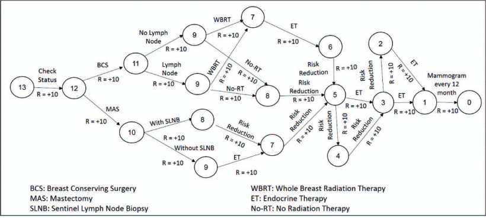

# Overview

The repository encompasses a simulated environment for modeling the dynamic progression of breast cancer patients at the DCIS stage. The simulation employs a Markov decision process, as detailed in the paper titled *Robust AI-enabled Simulation of Treatment Paths with Markov Decision Process for Breast Cancer Patients*. The simulator is designed to emulate treatment pathways for breast cancer DCIS patients based on the recommended treatments outlined in the National Comprehensive Cancer Network (NCCN) guidelines.

The diagram illustrates condensed potential treatment routes for recovered patients within the simulator. Each node symbolizes the physiological state of the patient, and the values associated with each node depict an ordered scale indicating the progression from having carcinoma to achieving full recovery.

The repository also includes an implementation of the simulator leveraging Deep Q-Network to learn optimal clinical pathways navigating the simulator.

# Usage

The source code for the simulator is inside **gym_breastcancer** and requires python module **gym=0.20.0** to run. 